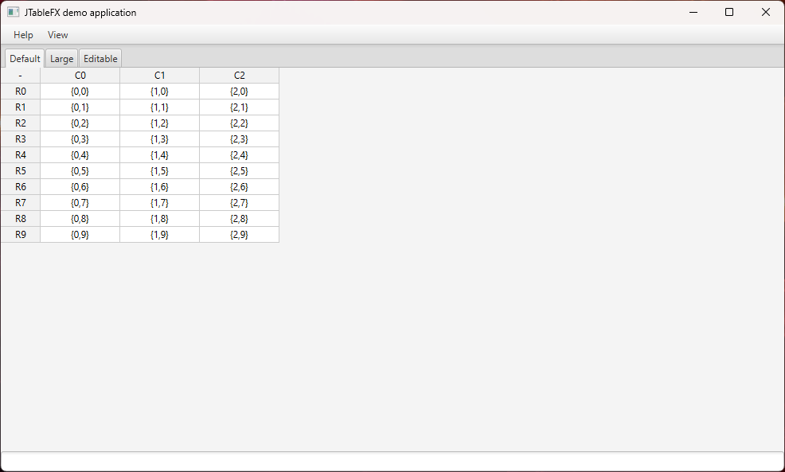
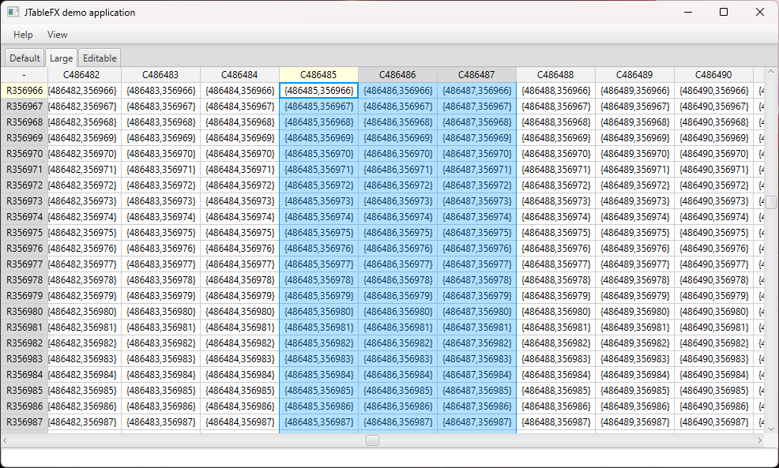
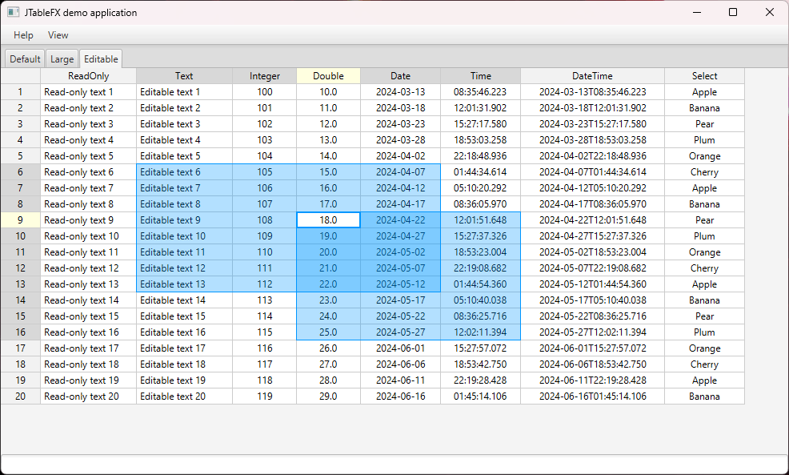
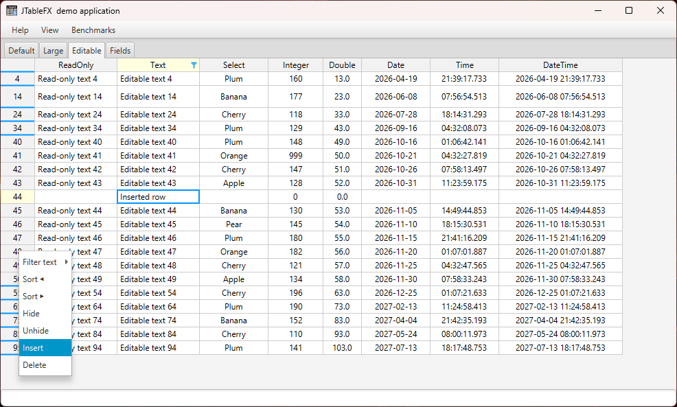
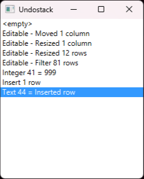

# JTableFX

JTableFX is an open-source JavaFX library for building high-performance, spreadsheet-style table views with rich interaction and editable data operations. It is designed for desktop applications that need more than a basic table widget, with support for undoable editing, resizing, reordering, hiding & unhiding, sorting, filtering, inserting and deleting rows and columns.

[](https://www.gnu.org/licenses/gpl-3.0)
[](https://github.com/dazzle50/JTableFX/releases)
[![DeepWiki](https://img.shields.io/badge/DeepWiki-dazzle50%2FJTableFX-blue.svg?logo=)](https://deepwiki.com/dazzle50/JTableFX)
[](https://x.com/JTableFX)

## Why JTableFX?

JTableFX is intended for applications that need spreadsheet-style behaviour inside a JavaFX UI. It focuses on editable grid data, rich row and column operations, undoable changes, and responsive handling of larger datasets.


## Features

- **Spreadsheet-style table interaction**
  - Cell, row, and column selection
  - Mouse and keyboard navigation
  - Zoom support (`Ctrl +/-/0`)

- **Editable and undoable table operations**
  - Built-in support for multiple cell value types with specialised editors
  - Resize, reorder, hide, unhide, sort, and filter rows and columns
  - Insert, delete, and append table data
  - Undo/redo framework supporting all operations

- **Performance-oriented design**
  - Efficient rendering and interaction for larger datasets
  - Responsive handling of slower operations
  - Optimised internal index, mapping, and layout behaviour

- **Extensible architecture**
  - Model-view-controller design supporting multiple views from single data sources
  - Flexible APIs for integrating custom data models and behaviours
  - Utility classes including date, time, and datetime handling and parsing

## Demo Application

The demo application showcases JTableFX in a range of scenarios, including standard table usage, larger datasets, editable data, and undo/redo support.

### Default table


### Large dataset view


### Editable table example




### Undo stack window


## Getting Started

### Requirements

- **Java 21+**
- **JavaFX 21+** if your JDK does not bundle JavaFX

A JDK with bundled JavaFX can simplify setup, such as [Azul Zulu builds](https://www.azul.com/downloads/?package=jdk-fx) with JavaFX included.

### Running the demo from the command line

Download the latest JAR from the [Releases](https://github.com/dazzle50/JTableFX/releases) page and run it from the command line.

If your Java runtime does not include JavaFX, supply the JavaFX module path:
```
java --module-path %PATH_TO_FX% --add-modules=javafx.controls JTableFX.jar
```

### Eclipse setup

If you are using Eclipse and your JDK does not bundle JavaFX:

1. Install a JDK 21 or newer.
2. Download the JavaFX SDK from [Gluon](https://gluonhq.com/products/javafx/).
3. In Eclipse, create a new *User Library*:
   - `Window -> Preferences -> Java -> Build Path -> User Libraries -> New`
4. Add the JARs from the JavaFX SDK `lib` folder to that library.
5. Add the library to your project's *Modulepath*:
   - `Project -> Properties -> Java Build Path -> Libraries -> Add Library`
6. Import the JTableFX source and build/run the project.

### Running from Windows Explorer

For easier launching of JavaFX JAR files from Windows, you can use the provided [run_javafx.cmd](run_javafx.cmd) helper script.

1. Create an environment variable named `PATH_TO_FX` pointing to the JavaFX SDK `lib` directory.
2. Place `run_javafx.cmd` in a suitable location.
3. Associate `.jar` files with `run_javafx.cmd`.

Double-clicking a runnable JAR should then open a command window and launch the JavaFX application.

## Built with

* [Java](https://en.wikipedia.org/wiki/Java_(programming_language)) - General-purpose computer programming language
* [JavaFX](https://en.wikipedia.org/wiki/JavaFX)  - Java software library used to generate the application's interactive graphical user interface
* [Eclipse](https://en.wikipedia.org/wiki/Eclipse_(software)) - Integrated development environment (IDE) used to develop the project
