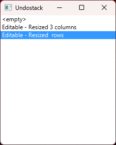

# JTableFX

JTableFX is an open-source JavaFX library that provides a flexible, configurable, and high-performance table control for displaying and interacting with spreadsheet-like data grids. Built with a model-view-controller (MVC) architecture, it offers a rich set of features for developers building interactive GUI applications.

[](https://www.gnu.org/licenses/gpl-3.0)
[](https://github.com/dazzle50/JTableFX/releases)
[![DeepWiki](https://img.shields.io/badge/DeepWiki-dazzle50%2FJTableFX-blue.svg?logo=data:image/png;base64,iVBORw0KGgoAAAANSUhEUgAAACwAAAAyCAYAAAAnWDnqAAAAAXNSR0IArs4c6QAAA05JREFUaEPtmUtyEzEQhtWTQyQLHNak2AB7ZnyXZMEjXMGeK/AIi+QuHrMnbChYY7MIh8g01fJoopFb0uhhEqqcbWTp06/uv1saEDv4O3n3dV60RfP947Mm9/SQc0ICFQgzfc4CYZoTPAswgSJCCUJUnAAoRHOAUOcATwbmVLWdGoH//PB8mnKqScAhsD0kYP3j/Yt5LPQe2KvcXmGvRHcDnpxfL2zOYJ1mFwrryWTz0advv1Ut4CJgf5uhDuDj5eUcAUoahrdY/56ebRWeraTjMt/00Sh3UDtjgHtQNHwcRGOC98BJEAEymycmYcWwOprTgcB6VZ5JK5TAJ+fXGLBm3FDAmn6oPPjR4rKCAoJCal2eAiQp2x0vxTPB3ALO2CRkwmDy5WohzBDwSEFKRwPbknEggCPB/imwrycgxX2NzoMCHhPkDwqYMr9tRcP5qNrMZHkVnOjRMWwLCcr8ohBVb1OMjxLwGCvjTikrsBOiA6fNyCrm8V1rP93iVPpwaE+gO0SsWmPiXB+jikdf6SizrT5qKasx5j8ABbHpFTx+vFXp9EnYQmLx02h1QTTrl6eDqxLnGjporxl3NL3agEvXdT0WmEost648sQOYAeJS9Q7bfUVoMGnjo4AZdUMQku50McDcMWcBPvr0SzbTAFDfvJqwLzgxwATnCgnp4wDl6Aa+Ax283gghmj+vj7feE2KBBRMW3FzOpLOADl0Isb5587h/U4gGvkt5v60Z1VLG8BhYjbzRwyQZemwAd6cCR5/XFWLYZRIMpX39AR0tjaGGiGzLVyhse5C9RKC6ai42ppWPKiBagOvaYk8lO7DajerabOZP46Lby5wKjw1HCRx7p9sVMOWGzb/vA1hwiWc6jm3MvQDTogQkiqIhJV0nBQBTU+3okKCFDy9WwferkHjtxib7t3xIUQtHxnIwtx4mpg26/HfwVNVDb4oI9RHmx5WGelRVlrtiw43zboCLaxv46AZeB3IlTkwouebTr1y2NjSpHz68WNFjHvupy3q8TFn3Hos2IAk4Ju5dCo8B3wP7VPr/FGaKiG+T+v+TQqIrOqMTL1VdWV1DdmcbO8KXBz6esmYWYKPwDL5b5FA1a0hwapHiom0r/cKaoqr+27/XcrS5UwSMbQAAAABJRU5ErkJggg==)](https://deepwiki.com/dazzle50/JTableFX)
[](https://x.com/JTableFX)

## Features

- **MVC Architecture**: Built with a model-view-controller pattern for modular and maintainable code.
- **Highly Configurable**: Customise appearance and behaviour through method overloading.
- **Performance Optimised**: Efficient memory and performance for large datasets.
- **Interactive Navigation**: Supports mouse and keyboard interactions for seamless user experience.
- **Flexible Data Model**: Define table size and manage cell values with ease.
- **Rich Table View**:
  - Supports multiple cell value data types with built-in display and editing.
  - Cell, column, and row selection, resizing, hiding, and reordering.
  - Zoom functionality (Ctrl +/-/0).
- **Utility Features**: Includes an undo-stack for user actions.
- **Extensible**: Easily extend functionality for custom use cases.

## Demo application

Explore JTableFX's capabilities through the included demo application, showcasing various configurations and features.




## Getting Started

### Prerequisites

- **Java 21+**: Use a JDK with bundled JavaFX (e.g., [Azul Zulu with JavaFX](https://www.azul.com/downloads/?package=jdk-fx)) or install JavaFX separately.
- **JavaFX 21+**: Required if your JDK does not include JavaFX. Download from [Gluon](https://gluonhq.com/products/javafx/).

#### Eclipse Setup (Windows if JavaFX not bundled in JDK)
1. **Install OpenJDK 21+**:
   - Download from [OpenJDK](https://openjdk.java.net/install/).
   - Unzip to a desired location.
   - Update the `PATH` environment variable to include the JDK's `bin` folder.
   - Set the `JAVA_HOME` environment variable to the JDK installation path (excluding `bin`).
   - Configure the JDK in Eclipse.

2. **Install JavaFX 21+**:
   - Download the [JavaFX SDK](https://gluonhq.com/products/javafx/) and unzip it.
   - In Eclipse, create a new *User Library* (`Window -> Preferences -> Java -> Build Path -> User Libraries -> New`).
   - Name it `JavaFX` and add the JARs from the JavaFX SDK's `lib` folder.
   - Add the `JavaFX` library to your project's *Modulepath* (`Project -> Properties -> Java Build Path -> Libraries -> Add Library`).

3. Import the JTableFX source code into Eclipse and build/run the project.

### Running the demo application from command line

The demo application can be executed by downloading the latest JAR from the project releases page and launching from the command-line.\
Unless your Java runtime includes JavaFX some extra command-line parameters are needed to reference the JavaFX library. 

```
java --module-path %PATH_TO_FX% --add-modules=javafx.controls JTableFX.jar
```

### Running the demo application from Windows

To enable easy execution of JavaFX applications from Windows desktop or file explorer, you can use a command batch file such as [run_javafx.cmd](run_javafx.cmd)
* Create environment variable **PATH_TO_FX** pointing to the lib directory of the JavaFX SDK
* Create command file *run_javafx.cmd* in a desired location
* Associate JAR file type with *run_javafx.cmd* by right-click on a jar file, under *General* click *Change...* and locate & select the *run_javafx.cmd* command file

Now double-clicking any JAR file should open a command-line window and launch a runnable JAR Java application.

## Built with

* [Java](https://en.wikipedia.org/wiki/Java_(programming_language)) - General-purpose computer programming language
* [JavaFX](https://en.wikipedia.org/wiki/JavaFX) - Java software library used to generate the application's interactive graphical user interface 
* [Eclipse](https://en.wikipedia.org/wiki/Eclipse_(software)) - Integrated development environment (IDE) used to develop the project